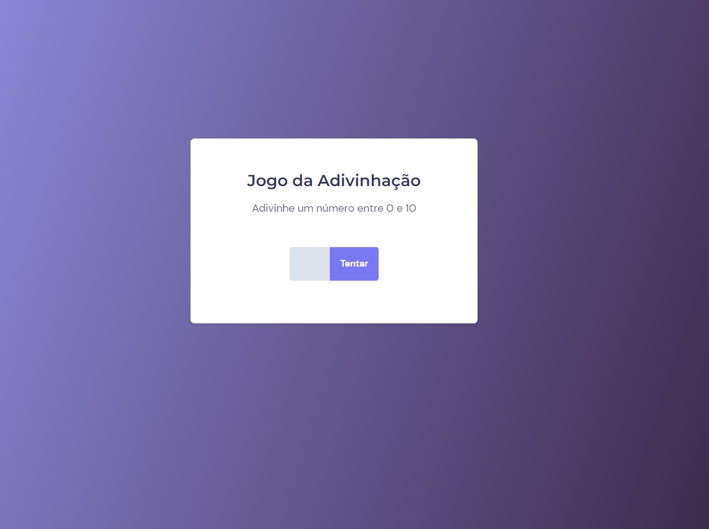

## Exercício JavaScript03 Rocketseat - Explorer
Criar um jogo simples para adivinhar um número de 0 a 10 e mudar a tela quando acertar.
### [Clique aqui para ver o projeto](https://colelladev.github.io/exeJavaScript03/)

